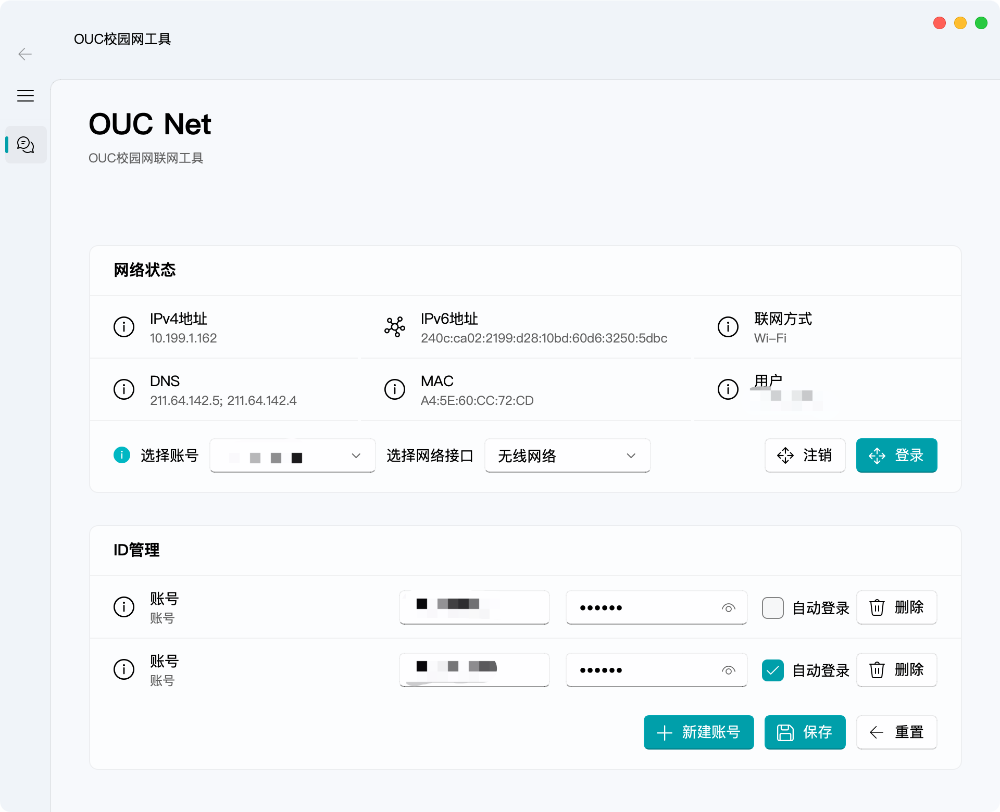

# OUC-NET
## 介绍
基于QT 开发的OUC校园网自动登录工具。

## 特性

- 保存多个账号密码，启动应用时自动连接校园网
- 跨平台：支持Windows和macOS
- 支持最小化至系统托盘，保持后台运行

## 使用



## 开发

Python 3.11

1. 下载本项目：
    ```shell
    git clone https://github.com/int233/ouc-net.git
    cd ouc-net
    ```

2. 安装依赖
    ```shell
    pip install -r requirements.txt
    pip install "PySide6-Fluent-Widgets[full]" -i https://pypi.org/simple/
    ```
3. 启动应用

    ```shell
    python main.py
    ```

## Todo

- [ ] 托盘图标
- [ ] 自动通过指定接口连接网络，并劫持网络登录窗口

## 致谢

1. UI基于[@zhiyiYo](https://github.com/zhiyiYo)开发的[Fluent-Widgets](https://github.com/zhiyiYo/PyQt-Fluent-Widgets)
